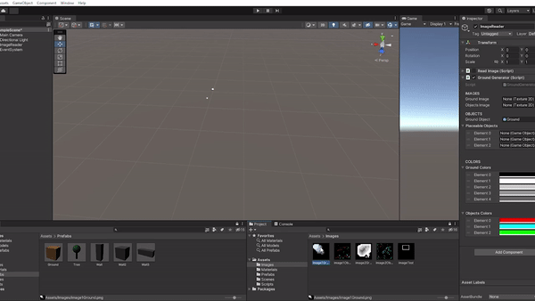
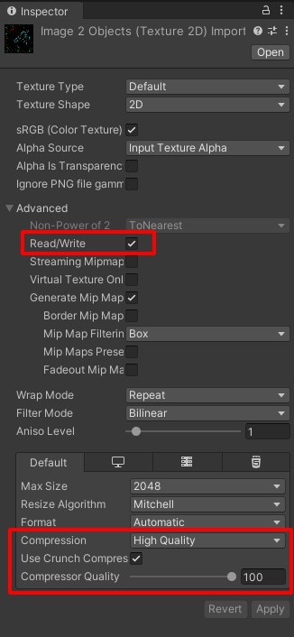

# UnityLevelGeneratorFromImages - Unity3D Level Generator Prototype

## Herkese Selamlar

Bu proje, Unity ile yaptığım bazı oyunlarda **çok fazla level dizaynı** yapmam gerektiği zamanlarda daha hızlı bir şekilde dizaynlar yapabilmek için oluşturduğum bir projem.

Bu projeyi yapmamdaki amaç; Unity ile 3D oyun yaparken ki süreçte levellar dizayn ederken harcadığım süreyi kısaltabilmek.

Henüz geliştirmekte olduğum bu projemde v0.1.0'ı oluşturdum ve sizlere sunuyorum.

## İçindekiler

0. [Herkese Selamlar](#herkese-selamlar)
1. [Uygulama Hakkında](#uygulama-hakkında)
2. [Görsel Açıklama](#gorsel-aciklama)
3. [Youtube Linki](#youtube-linki)

## Uygulama Hakkında

Uygulama içerisindeki amaç, oyun platformları üzerinde çok fazla level gerektiren oyunların level dizaynlarındaki harcana süreci kısaltmak ve bu levelları bir biriyle karıştırarak daha fazla sonuç elde edebilmek.

Levelları oluştururken 2 farklı görüntü hazırlamamız gerekiyor. Birinci görüntü siyah-beyaz tonlarında bir görsel olmalı. Bu görsel bize level'ın yeryüzü şeklini oluşturacak.

İkinci görüntü ise bu görüntü üzerine yerleştirilecek nesnelerin yerlerini belirtecek olan görsel. Yerleştirilmek istenen her farklı nesne için ayrı bir renk kullanılması gerekiyor. 

Oluşturulan görsellerde kullanılan renkler RGBA(0-1) boyutunda Script'in Inspector üzerindeki değerlerine eklenerek 'Alpha' değerleri 1'e ayarlanıyor.

Renkler ayarlandıktan sonra kullanılacak görseller ve nesneler yine Inspector üzerinden seçilerek Script içerisindeki değerlere ekleniyor.

(NOT: Harici olarak eklediğiniz görsellerin Read/Write mod'unu etkinleştirmeniz gereklidir. Ayrıca düzgün çalışmadığını düşündüğünüz durumlar için Image'in ayarlarından compress düzeyini değiştirebilirsiniz. Çok sık değişen piksellerde düzgün çalışmaması durumunu göz önüne alarak 'HighAccurracy' adında bir bool oluşturdum. Bu bool'u true yaparak en doğru sonuçları alabilirsiniz ancak gerekmediği takdirde kullanmanızı tavsiye etmem. Optimizasyon konusunda sorunlar çıkartabilir.) 

## Görsel Açıklama

Görselleri Project'ten Scriptteki konumuna ekleme:

Nesneleri Scriptteki konumuna ekleme:

Harici görsellerin ayarları:

## Youtube Linki

Youtube üzerinden paylaştığım uygulama videosuna [bu linkten](https://youtu.be/CyaP6tf7Qhw) ulaşabilirsiniz.
